# 💻 Command Injection – High SIEM Alert Investigation

## 🔍 Project Overview
In this project, I investigated a **High-severity SIEM alert** indicating potential Command Injection activity. The alert flagged the string `ls` within a URL request. My investigation involved analyzing web server access logs, endpoint logs, and IP reputation to determine if the activity was a true cyber threat or a false positive.

---

## 💡 Initial Analyst Hypothesis
The initial hypothesis was that an attacker attempted to execute system commands (like `ls`) on the web server via URL or POST parameters. The goal of the investigation was to validate whether this was a successful exploit or a non-malicious event.

---

## 🛠️ Investigation Steps

### Step 1: Alert Acknowledgement and Ownership
I received and acknowledged the SIEM alert, officially taking ownership of the case to begin the forensic process.

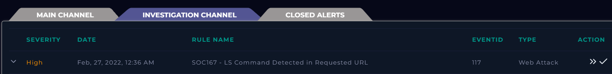
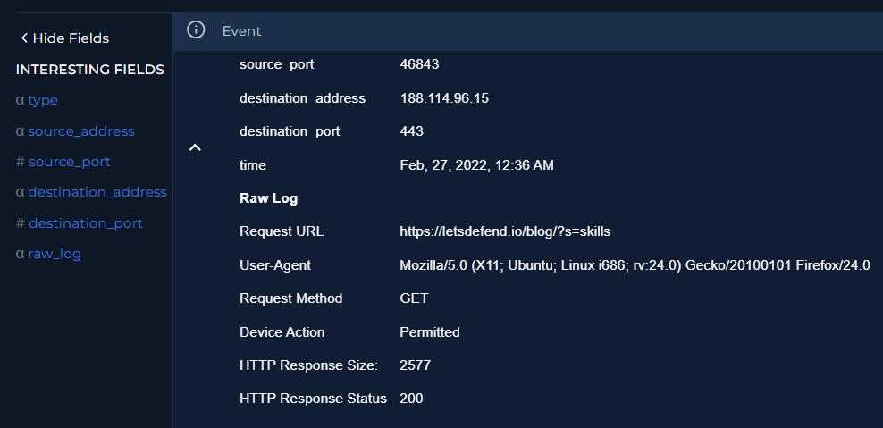

### Step 2: Deep Log Analysis and Traffic Review
I reviewed the logs using the source IP and timestamp. While the alert flagged the `ls` string, the actual POST parameters showed a legitimate search query: `?s=skills`.
* **Full URL**: `https://letsdefend.io/blog/?s=skills`
* **HTTP Response**: 200 OK (2577 bytes).
* **Conclusion**: Comparison with other requests from this IP confirmed normal user browsing behavior.

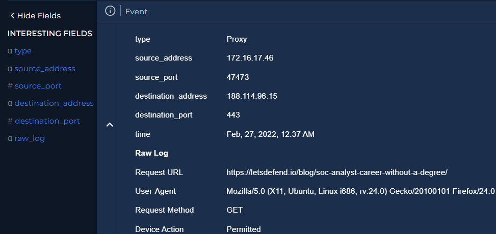
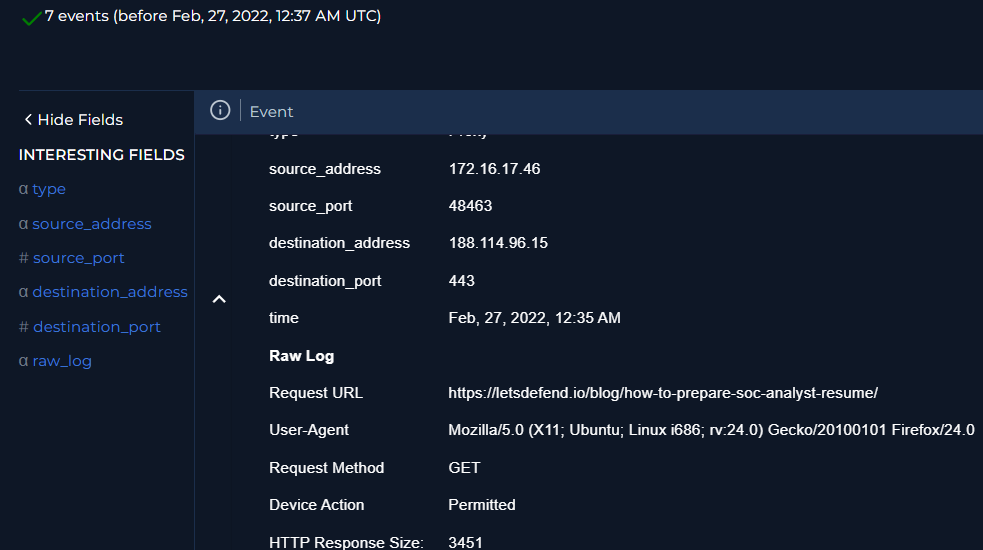

### Step 3: Threat Intelligence and IP Reputation
I performed an external reputation check on the source IP to identify any known malicious history.
* **VirusTotal Score**: 0 (Clean).
* **IP Ownership**: Private / Reserved IP address with no known malicious reputation.

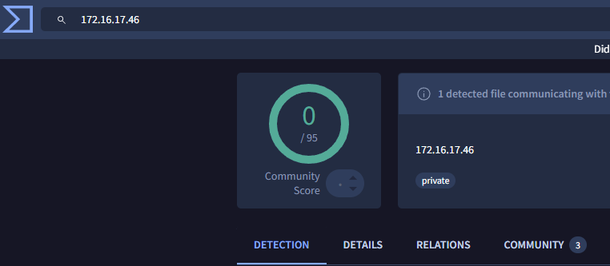
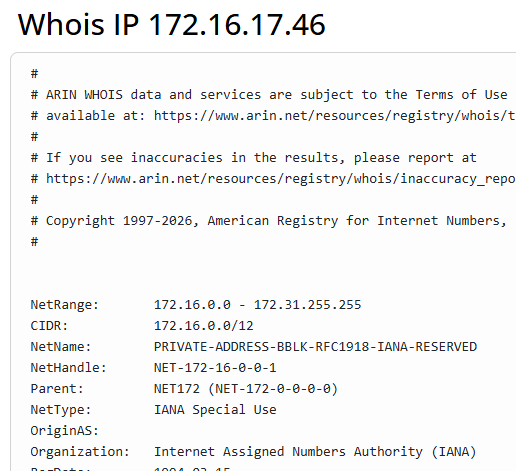

### Step 4: Verification of Authorized Testing
I checked the Email Security mailbox to see if any internal security teams were conducting authorized penetration testing or vulnerability scanning. No records of planned testing were found.

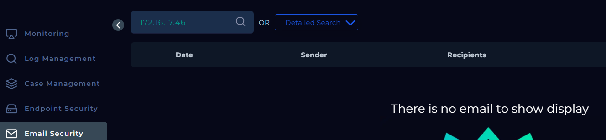
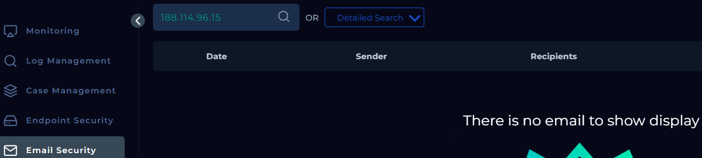

### Step 5: Playbook Execution and Validation
I followed the SIEM playbook to document the evidence. The investigation supported a **False Positive** conclusion based on:
* Clean VirusTotal results.
* Lack of command injection syntax in the URL.
* Normal endpoint logs showing no unauthorized system commands executed.

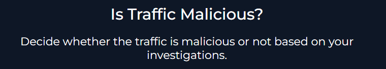

### Step 6: Final Traffic Validation and Case Closure
After reviewing additional traffic and confirming no other malicious activity was present, I entered final analyst comments and officially closed the incident in the SIEM.

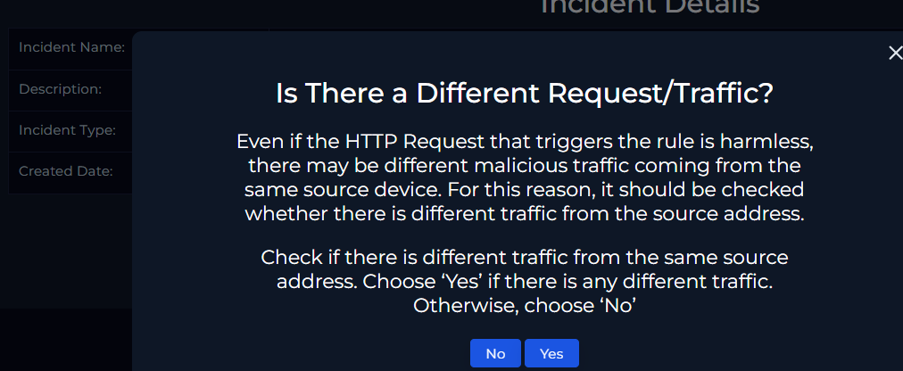
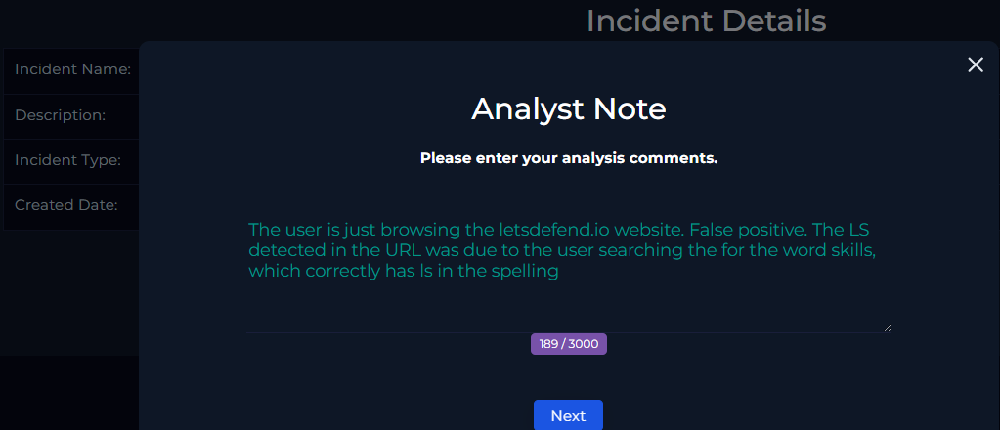
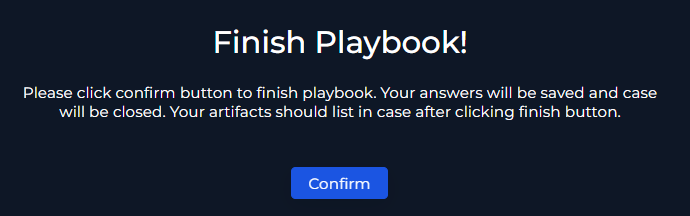
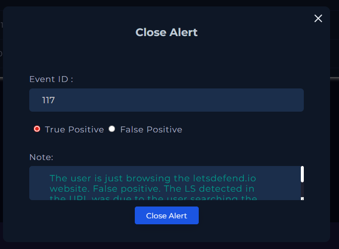

---

## 🏁 Project Wrap-Up / Conclusion
This investigation determined the alert to be a **False Positive**. The flagged `ls` string was part of a legitimate search query (`skills`), and no actual command execution occurred. This project highlights my ability to use SIEM playbooks, perform IP reputation checks, and conduct granular log analysis to distinguish between noise and actual security threats.

---

## 🔒 Mitigation & Recommendations

Based on the findings from this investigation, the following security measures are recommended to prevent command injection vulnerabilities:

- **Implement strict input validation and sanitization** to ensure user-supplied data cannot be interpreted as system commands.
- **Use parameterized or safe API methods** when executing system-level operations instead of directly passing user input to command interpreters.
- **Apply the principle of least privilege** so that application processes do not run with unnecessary system-level permissions.
- **Disable unnecessary command execution capabilities** within the application environment.
- **Deploy WAF rules capable of detecting command injection patterns** such as shell operators (`;`, `&&`, `|`) and suspicious command strings.

## 🛡️ Skills Demonstrated
* **SIEM Incident Response**: Managing alerts from detection through to closure.
* **Log Forensics**: Identifying the difference between malicious payloads and legitimate URL parameters.
* **Threat Intelligence**: Utilizing VirusTotal for IP and domain reputation analysis.
* **Playbook Adherence**: Following structured SOC procedures to validate and document findings.
