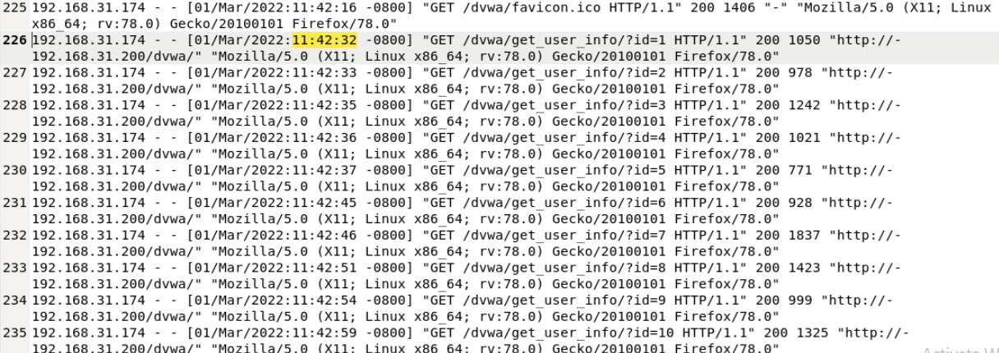

# 🔑 IDOR (Insecure Direct Object Reference) Attack Investigation

## 🔍 Project Overview
This project demonstrates the analysis of Apache access logs to identify activity consistent with an **Insecure Direct Object Reference (IDOR)** attack. The investigation focuses on identifying abnormal request patterns, analyzing HTTP response codes, and assessing whether an attacker attempted to enumerate and access unauthorized user resources.

---

## 🛠️ Investigation Steps

### Step 1: Identifying Suspicious Activity in Apache Logs
I began the investigation by reviewing Apache access logs to identify unusual request patterns. I observed that the IP address **192.168.31.174** was generating a high volume of requests within a very short time interval, a behavior commonly associated with automated scanning or scripted attacks.

* **Observation**: The attacker was repeatedly requesting different user IDs through the same endpoint.
* **Analysis**: This pattern is consistent with **object enumeration**, a primary technique used to exploit IDOR vulnerabilities.

### Step 2: Analyzing Server Response Codes
After identifying the enumeration pattern, I reviewed the HTTP response codes returned by the server to determine the success of the attempts.

* **Finding**: The logs showed consistent **HTTP 200 OK** responses, indicating the server successfully processed the requests.
* **Security Note**: While 200 OK confirms the request was processed, further analysis of application logs would be required to confirm the exact scale of sensitive data exposure.

---

## 🏁 Project Wrap-Up / Conclusion
Through systematic log analysis, I identified behavior consistent with a potential **IDOR attack attempt** originating from IP **192.168.31.174**. The high-volume enumeration of user IDs combined with successful HTTP 200 responses strongly suggests an attempted exploitation of a web application vulnerability. This investigation highlights the importance of monitoring for rapid resource enumeration to prevent unauthorized data access.

---

## 🔒 Mitigation & Recommendations

Based on the results of this investigation, the following measures are recommended to prevent Insecure Direct Object Reference (IDOR) vulnerabilities:

- **Implement proper authorization checks** to ensure users can only access resources they are explicitly permitted to view.
- **Avoid exposing predictable object identifiers** such as sequential IDs within URLs or request parameters.
- **Use indirect reference maps or randomized identifiers** to prevent attackers from easily enumerating resources.
- **Perform server-side access validation for every request**, rather than relying on client-side controls.
- **Monitor logs for abnormal access patterns**, such as repeated attempts to access multiple object IDs from a single user session or IP address.

## 🛡️ Skills Demonstrated
* **Web Server Log Analysis**: Identifying indicators of compromise (IoC) within Apache access logs.
* **Pattern Recognition**: Detecting automated object enumeration and abnormal request volumes.
* **Vulnerability Assessment**: Investigating web application flaws like Insecure Direct Object Reference.
* **Traffic Attribution**: Correlating suspicious activity to a specific source IP address.
