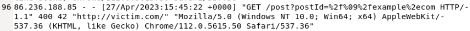

# Open Redirect Attack Investigation – Apache Access Logs

## 🔍 Project Overview
In this project, I analyzed Apache access logs to identify activity consistent with an **Open Redirect attack**. By reviewing the logs, I detected a request containing URL-encoded characters designed to redirect users to a malicious third-party site. This investigation demonstrates my ability to detect encoded attack payloads, identify targeted parameters, and accurately assess attack success through log analysis.

---

## 🛠️ Investigation Steps

### Step 1: Identified Potential Open Redirect Activity
I reviewed Apache access logs to identify any indicators of an Open Redirect attack. During my review, I noticed a request on **27/Apr/2023 at 15:45:22** that contained a suspicious string of URL-encoded characters.

* **Encoded Parameter**: `postId=%2f%09%2fexample%2ecom`
* **Decoded Value**: `postId= //example.com`
* **Analysis**: The decoded parameter referenced an **external domain**, which is a common indicator of an open redirect attempt. The use of URL-encoded characters suggested an attempt to obfuscate the payload and bypass basic input validation.

### Step 2: Identified the Attacker IP Address
After identifying the suspicious request, I took note of the source IP address associated with the activity.
* **Attacker IP**: `86.236.188.85`
* **Attribution**: This allowed me to attribute the malicious activity to a specific source.

### Step 3: Identified the Vulnerable Parameter
I reviewed the request in more detail and identified that the **`postId`** parameter was the targeted input field. This confirmed that the attacker was attempting to manipulate this parameter to redirect users to an external site.

### Step 4: Analyzed Server Response to Determine Attack Success
I reviewed the server response code for the suspicious request to determine if the exploitation was successful.
* **Server Response**: **HTTP 400 (Bad Request)**
* **Conclusion**: This indicates that the server rejected the request. The redirect was not processed, and no redirection occurred. Based on this response, I determined the open redirect attack attempt was **unsuccessful**.

## 🏁 Project Wrap-Up / Conclusion
Through systematic log analysis, I identified a request containing URL-encoded characters within the `postId` parameter, which decoded to an external domain (`example.com`). While the attacker attempted to use encoding to bypass basic validation, the server successfully rejected the request with a **400 Bad Request** response. This project demonstrates my ability to accurately detect and assess attack success through web server log forensics.

## 🛡️ Skills Demonstrated
* **Web Server Log Analysis**: Expertise in parsing Apache access logs for security events.
* **Payload Decoding**: Ability to identify and decode URL-encoded characters to reveal attacker intent.
* **Vulnerability Identification**: Understanding the mechanics of Open Redirect and parameter manipulation.
* **Attack Outcome Assessment**: Using HTTP response codes to verify the success or failure of an attack.
