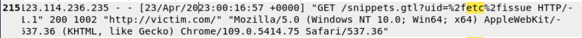
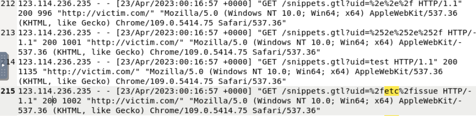

# Directory Traversal Attack Investigation – Apache Access Logs

## 🔍 Project Overview
In this project, I analyzed Apache web server logs to identify and investigate activity consistent with a **Directory Traversal attack**. Through log forensics, I identified the attacker's source IP, the targeted application parameter, and analyzed server response behavior to assess the potential impact and data exposure.

---

## 🛠️ Investigation Steps

### Step 1: Reviewed Logs for Directory Traversal Indicators
I reviewed web server log files to identify any indicators of a Directory Traversal attack. I focused on requests that could indicate attempts to access files or directories outside of the intended application scope.

* **Suspicious Request identified**: A GET request to `/snippets.gtl` containing encoded traversal characters.

### Step 2: Identified the Attacker IP Address
While analyzing the logs, I isolated the source IP address associated with the suspicious activity.
* **Attacker IP address**: `123.114.236.235`.

### Step 3: Identified the Targeted Parameter
I continued reviewing the request details and determined that the **`uid` parameter** was the input field targeted during the attack attempt. This confirmed the attacker was attempting to manipulate this specific parameter to access unauthorized resources.

### Step 4: Analyzed Server Response and Response Size
I reviewed the server response code and confirmed the server returned an **HTTP 200 OK** response, indicating the request was processed. To assess potential impact, I analyzed the response size and compared it to nearby baseline requests:
* **Suspicious Request Size**: 1002 bytes.
* **Baseline Request Sizes**: 1135, 1001, and 996 bytes.
* **Conclusion**: Because the response size was consistent with normal traffic patterns, I could not conclusively determine whether sensitive data was returned.

---

## 🏁 Project Wrap-Up / Conclusion
In this project, I successfully identified a Directory Traversal attack attempt originating from IP `123.114.236.235` targeting the `uid` parameter. Although the server returned an **HTTP 200 response**, the lack of significant deviation in response size suggests that the attempt may not have resulted in sensitive data exfiltration. This project demonstrates my ability to detect directory traversal attempts, analyze targeted parameters, and evaluate attack impact through comparative log analysis.

---

## 🛡️ Skills Demonstrated
* **Web Server Log Analysis**: Identifying indicators of compromise (IoC) in Apache logs.
* **Attack Reconstruction**: Isolating attacker IP addresses and identifying vulnerable parameters.
* **Impact Assessment**: Analyzing HTTP response codes and response sizes to determine the severity of an incident.
* **Forensic Correlation**: Comparing malicious traffic against baseline behavior to verify attack success.  
