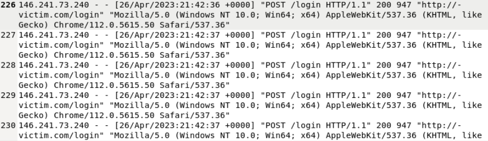

# Brute Force Attack Investigation – Authentication Logs

## 🔍 Project Overview
In this project, I analyzed authentication logs to identify and investigate a **Brute Force login attack**. By reviewing the frequency and speed of login attempts, I differentiated between automated bot behavior and normal user activity. I successfully identified the attacker's source IP, their User-Agent, and the exact moment the attack resulted in a successful unauthorized login.

---

## 🛠️ Investigation Steps

### Step 1: Identified Brute Force Login Behavior in Logs
I reviewed authentication logs to identify potential Brute Force login attempts. During my review, I observed a single IP address attempting to authenticate multiple times within a very short timeframe.

* **Attacker IP**: `146.214.73.240`
* **Observation**: The frequency and speed of the login attempts were faster than what would be humanly possible, strongly indicating the use of an automated script or bot attempting to brute force credentials.

### Step 2: Identified the Attacker’s User-Agent
I was tasked with identifying the attacker's User-Agent from the log entries to validate the consistency of the attack traffic.

* **User-Agent**: `Mozilla/5.0 (Windows NT 10.0; Win64; x64) AppleWebKit/537.36 (KHTML, like Gecko) Chrome/112.0.5615.50 Safari/537.36`
* **Significance**: Identifying the User-Agent helped attribute the activity to the same source and confirmed it was a modern browser environment being emulated by the attack tool.

### Step 3: Determined When the Brute Force Attack was Successful
I continued reviewing the logs to determine whether the brute force attack was eventually successful.

* **Finding**: I identified an **HTTP 302 response** on **26/Apr/2023 at 21:44:03**.
* **Analysis**: This response code indicates a successful authentication followed by a redirect. This confirmed the exact date and time the attacker successfully breached the account.

---

## 🏁 Project Wrap-Up / Conclusion
Through systematic log analysis, I detected a brute force attack originating from IP `146.214.73.240`. While the initial logs showed rapid failed attempts, the discovery of an **HTTP 302 response** confirmed that the attack was ultimately successful. This project demonstrates my ability to detect automated login patterns, analyze User-Agent data, and determine attack success using HTTP response codes—key skills for a SOC or Information Security Analyst role.

---

## 🛡️ Skills Demonstrated
* **Authentication Log Analysis**: Identifying automated credential stuffing and brute force patterns.
* **Behavioral Profiling**: Distinguishing between human and bot-driven traffic speeds.
* **Incident Timeline Reconstruction**: Pinpointing the exact moment of compromise using response code analysis.
* **Attribution & Forensic Analysis**: Extracting User-Agent strings and IP addresses for threat actor profiling.
