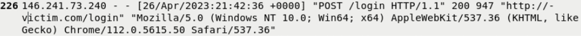
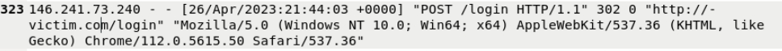

# Brute Force Attack Investigation – Authentication Logs

## 🔍 Project Overview
In this project, I analyzed authentication logs to identify and investigate a **Brute Force login attack**. 

---

## 🛠️ Investigation Steps

### Step 1: Identified Brute Force Login Behavior in Logs

### Step 2: Identified the Attacker’s User-Agent

### Step 3: Determined When the Brute Force Attack was Successful

---

## 🛡️ Skills Demonstrated
* **Authentication Log Analysis**
* **Behavioral Profiling**
* **Incident Timeline Reconstruction**
