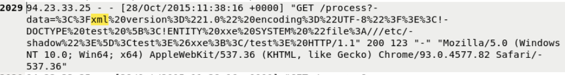
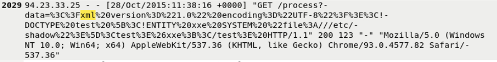

# XML External Entity (XXE) – Web Server Log Investigation

## 🔍 Project Overview
This project documents a forensic investigation into web server logs to identify an **XML External Entity (XXE)** attack. By analyzing encoded payloads, I decoded a malicious request designed to abuse XML parsing to read sensitive system files. This investigation covers attacker attribution, intent analysis, and an assessment of server-side security controls based on HTTP response behavior.

---

## 🛠️ Investigation Steps

### Step 1: Identified Potential XXE Activity in Web Server Logs
I reviewed web server logs for potential XXE activity by searching for the keyword **"XML"**, which immediately flagged several suspicious entries. 

* **Encoded Payload identified**: `data=%3C%3Fxml%20version%3D%221.0%22%20encoding%3D%22UTF-8%22%3F%3E%3C!DOCTYPE%20test%20%5B%3C!ENTITY%20xxe%20SYSTEM%20%22file%3A///etc/shadow%22%3E%5D%3Ctest%3E%26xxe%3B%3C/test%3E`
* **Decoded Content**: The payload translated to a valid XML document containing a **DOCTYPE declaration** and an **external ENTITY reference** pointing to `file:///etc/shadow`.

### Step 2: Determined Attacker Intent and Targeted Resource
After decoding the payload, I analyzed the intent and confirmed the attacker was attempting to access the **`/etc/shadow`** file.

* **Impact**: `/etc/shadow` is a critical Linux system file containing password hash information.
* **Conclusion**: This confirmed the activity was a malicious attempt to gain unauthorized access to credential-related system files.

### Step 3: Analyzed Server Response to Assess Attack Handling
I reviewed the server response code to determine if the application successfully blocked the malicious request.

* **Server Response**: **HTTP 200 OK**
* **Analysis**: This indicates the request was successfully processed and was **not blocked** by server-side controls. While the logs do not explicitly confirm if the contents of the file were returned in the response, the processing of a valid XXE payload suggests the application is vulnerable to improper XML parsing.

---

## 🏁 Project Wrap-Up / Conclusion
Through forensic log analysis, I identified a clear XXE attack attempt where an attacker used encoded XML data to target the sensitive `/etc/shadow` file. The server’s **HTTP 200 response** indicates a lack of proper input validation or hardened XML parsing configurations. This project demonstrates my ability to detect complex web-based attacks, decode obfuscated payloads, and assess the effectiveness of security headers and application-level controls.

---

## 🛡️ Skills Demonstrated
* **Advanced Log Forensics**: Identifying complex injection-style attacks in high-volume traffic.
* **Payload Decoding**: Utilizing tools to reveal hidden attacker intent within obfuscated data.
* **Linux System Security**: Understanding the significance of sensitive system files like `/etc/shadow`.
* **Vulnerability Assessment**: Correlating server response codes with attack payloads to identify potential security gaps.
