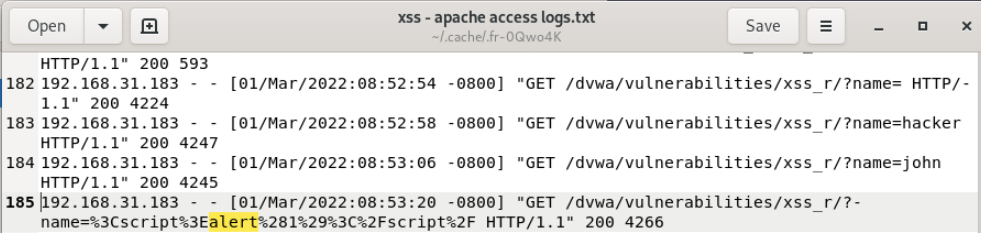
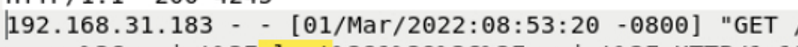
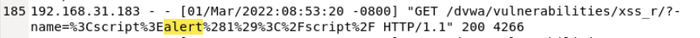

# 🚨 Cross-Site Scripting (XSS) Log Analysis

## 🔍 Project Overview
In this project, I analyzed Apache web server access logs to investigate a potential Cross-Site Scripting (XSS) attack. During the investigation, I identified malicious script payloads embedded within HTTP GET request parameters. By analyzing the log entries, I determined the source IP responsible for the activity, evaluated server response behavior, and classified the attack as a **Reflected Cross-Site Scripting (XSS) attempt**.

---

## 💡 Initial Analyst Hypothesis
During initial log review, I observed suspicious URL parameters containing encoded and unencoded script content. Based on these indicators, my initial hypothesis was that an attacker was attempting to exploit a **Reflected Cross-Site Scripting vulnerability** by injecting malicious client-side scripts into HTTP requests.

At this stage, it was unclear whether the payload had been successfully executed or if the server had blocked or sanitized the malicious input.

---

## 🛠️ Investigation Steps

### 1️⃣ Identifying Suspicious Script Payloads in Access Logs
I began the investigation by reviewing Apache web server access logs for indicators of script-based injection attempts.

During this review, I identified requests containing keywords such as `script` and `alert`, which are commonly associated with Cross-Site Scripting payloads. These indicators suggested that an attacker was attempting to inject client-side scripts through URL parameters.

From the log entry, I determined that the attack activity began at:

**01/Mar/2022:08:53:20**

---

### 2️⃣ Identifying the Attacker’s Source IP Address
Next, I analyzed the log entries associated with the malicious payload to identify the source of the attack traffic.

The requests containing the injected script payload were traced back to the following IP address:

**192.168.31.183**

This IP address consistently appeared in requests containing the malicious script content, indicating it was the likely origin of the attack attempts.

---

### 3️⃣ Analyzing HTTP Response Codes
To determine whether the malicious payload was processed by the server, I evaluated the HTTP response codes returned for the suspicious requests.

The server consistently returned:

**HTTP 200 OK**

No defensive indicators were observed, including:

- 400-series client errors  
- 403 Forbidden responses  
- WAF block messages  
- Redirects  
- Server-side error responses  

This suggested that the server processed the malicious request without blocking or sanitizing the input.

---

### 4️⃣ Classifying the XSS Attack Type
After analyzing the request behavior and server responses, I evaluated the characteristics of the attack to determine the specific XSS category.

The malicious script payload was embedded directly within the URL parameters and immediately processed by the server response.

Key observations included:

- No persistence mechanisms such as database writes or stored form submissions
- No evidence of DOM-based client-side execution without server interaction
- Payload delivered directly through the request URL

Based on these findings, the activity was classified as a **Reflected Cross-Site Scripting (XSS) attack**.

---

## 🏁 Project Wrap-Up / Conclusion
Through systematic analysis of Apache access logs, I identified a reflected Cross-Site Scripting (XSS) attack originating from the IP address **192.168.31.183**. The malicious payload was delivered through URL parameters and processed by the server, which returned **HTTP 200 OK responses**, indicating that the input was neither sanitized nor blocked.

The investigation confirmed the presence of exploitable input handling within the web application, allowing malicious client-side scripts to be reflected in server responses.

---

## 🛡️ Skills Demonstrated
- **Web Application Log Analysis**
- **Cross-Site Scripting (XSS) Detection**
- **Apache Access Log Investigation**
- **Attack Classification and Attribution**
- **Security Incident Documentation**
