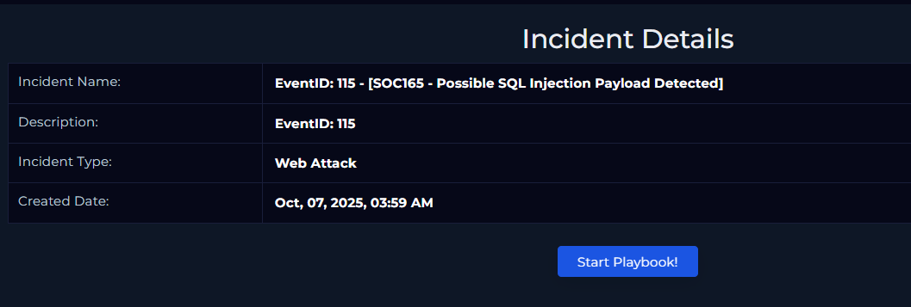

# SQL Injection (SQLi) – SIEM Alert Investigation

## 1. Alert Source
A SIEM alert triggered based on detection rules identifying SQL injection patterns within web traffic logs.

Alert triggered for:
- Suspicious SQL keywords in URL parameters  
- Tautology-based injection attempts  
- UNION-based query manipulation patterns  

## 2. Initial Triage Assessment
The alert indicated potential SQL injection attempts targeting a web application input field. Initial hypothesis was that an attacker was attempting to bypass authentication or extract database data.

## 3. Data Sources Reviewed
- SIEM alert metadata  
- Apache access logs  
- Correlated web traffic events  
- Source IP activity history  

## 4. Investigation Steps

1. Reviewed the SIEM rule that triggered the alert to understand detection logic.

*Figure 1: SQL injection detection rule triggered in SIEM.*
2. Identified HTTP requests containing SQL injection patterns such as:
   - ' OR '1'='1
   - UNION SELECT
   - SQL comment markers (--)

3. Analyzed request frequency from the source IP to determine if behavior indicated automated scanning.

4. Reviewed HTTP response codes:
   - 200 responses analyzed for potential successful injection  
   - 403 / 500 responses reviewed for blocked or failed attempts  

5. Correlated events within the SIEM to determine whether other attack techniques were observed from the same IP address.

## 5. Findings

- Multiple injection attempts detected from a single source IP  
- Patterns consistent with automated SQL injection scanning tools  
- No confirmed database compromise based on available logs  
- Activity classified as active exploitation attempt  

## 6. Conclusion

The SIEM alert accurately detected SQL injection attack attempts targeting the web application. Analysis confirmed malicious input patterns consistent with automated SQLi exploitation techniques. No confirmed data exfiltration was observed, but the activity represented a legitimate attack attempt.

This project demonstrates the ability to triage SIEM alerts, validate detection logic, analyze correlated web logs, and determine attack impact.

## 7. Mitigation & Recommendations

- Enforce parameterized queries (prepared statements)  
- Strengthen WAF rules for SQL injection detection  
- Monitor repeated injection attempts from external IPs  
- Consider IP blocking for persistent malicious sources  
