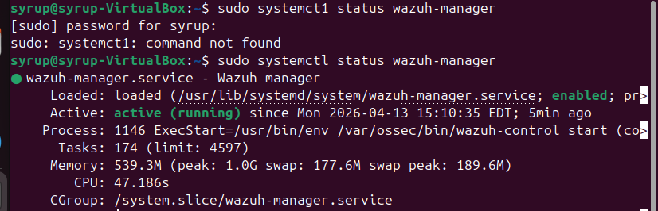
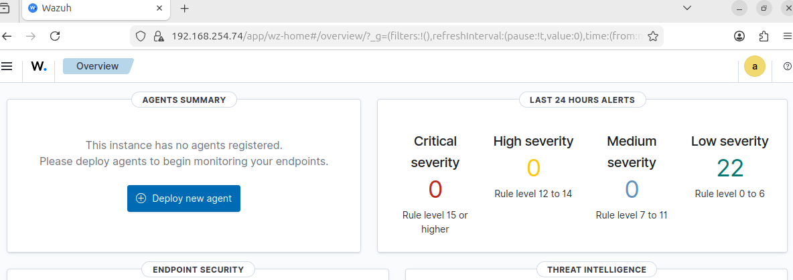
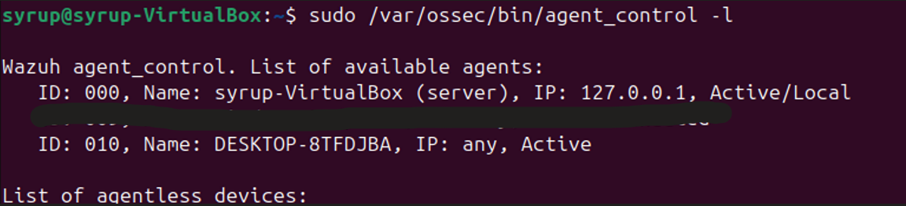
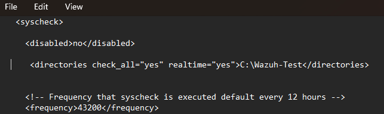
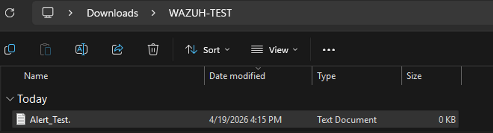
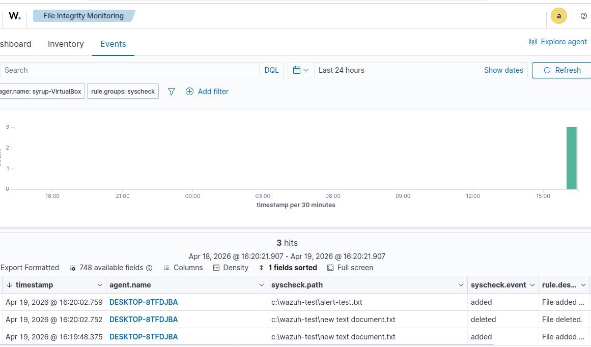

# 🛡️ Wazuh SIEM Deployment & File Integrity Monitoring (FIM)

## 🔍 Project Overview
This project demonstrates the deployment of a **Wazuh SIEM** environment designed to provide centralized security visibility. The primary objective was to establish a secure connection between a Linux-based manager and a Windows endpoint to perform **File Integrity Monitoring (FIM)** and real-time event analysis.

---

## 💡 Initial Objective
The objective of this project was to simulate a real-world SOC monitoring environment capable of detecting file-based attacks. Specifically, I aimed to identify file creation, modification, and deletion events on a Windows system and forward them to a centralized SIEM for analysis.

---

## 🛠️ Implementation Steps

### Step 1: Verifying the Wazuh Manager Service
The implementation began by ensuring the Wazuh Manager was fully operational on the Ubuntu VM. I verified the service status via the terminal to confirm the "brain" of the SIEM was active and ready to ingest telemetry.

---

### Step 2: Initial Dashboard Access
With the manager running, I accessed the Wazuh Web Dashboard. At this stage, the environment is a "blank slate," showing that the manager is initialized but has no agents registered yet.

---

### Step 3: Registering the Windows Agent
On the Ubuntu Manager, I used the `agent_control` utility to verify that the Windows endpoint had successfully completed the handshake. This terminal output confirms **ID: 010 (DESKTOP-8TFDJBA)** is officially **Active**.

---

### Step 4: Configuring the Windows Agent GUI
On the Windows endpoint, I utilized the **Wazuh Agent Manager** to finalize the connection. This required inputting the Manager’s IP and the unique Authentication Key generated by the Ubuntu server. 

---

### Step 5: Successful Agent Enrollment Overview
Returning to the Wazuh Dashboard, the **Agents Summary** now reflects a successful enrollment. The "Active" status indicator confirms that real-time data is now streaming from the Windows workstation to the manager.

---

### Step 6: Implementing Custom FIM Rules
To demonstrate proactive threat detection, I modified the agent’s `ossec.conf` file. I added a custom **File Integrity Monitoring (FIM)** rule to watch the directory `C:\Wazuh-Test` with `realtime="yes"`.

---

### Step 7: Generating a Security Event
To test the new monitoring rule, I navigated to the `C:\Wazuh-Test` directory and created a new file named `alert-test.txt`. This action was designed to trigger an immediate "File Added" alert.

---

### Step 8: Real-Time Alert Analysis
The final step was verifying the alert on the dashboard. The **Integrity Monitoring** module successfully captured the event, detailing the exact file path, the timestamp, and the nature of the modification (File Added).

---

## 🏁 Project Wrap-Up / Conclusion
This project resulted in a fully functional SIEM pipeline capable of detecting real-time file activity on a Windows endpoint. By establishing secure communication and configuring granular file integrity rules, I demonstrated how Wazuh provides the visibility necessary for incident response and compliance auditing. This setup mirrors real-world SOC workflows used to detect persistence techniques and unauthorized modifications.

---

## 🔒 Mitigation & Recommendations

- **Enforce strict version control** between SIEM managers and agents to prevent communication failures.
- **Enable real-time File Integrity Monitoring** on sensitive directories (e.g., System32, Program Files).
- **Regularly audit and remove** inactive or “ghost” agents to maintain a clean monitoring environment.
- **Implement centralized alerting** for unauthorized file activity to reduce mean time to detection (MTTD).
- **Integrate vulnerability detection** to identify and patch unpatched systems across the environment.

---

## 🛡️ Skills Demonstrated
- **SIEM Deployment (Wazuh)**: End-to-end installation and management of Manager and Agent components.
- **File Integrity Monitoring (FIM)**: Implementing real-time detection for unauthorized changes.
- **Windows Endpoint Configuration**: Modifying XML-based configuration files for custom security rules.
- **Linux System Administration**: Managing backend services and command-line utilities.
- **Log Analysis & Alert Validation**: Correlating endpoint actions with SIEM dashboard events.

