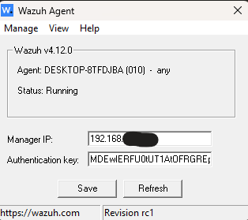
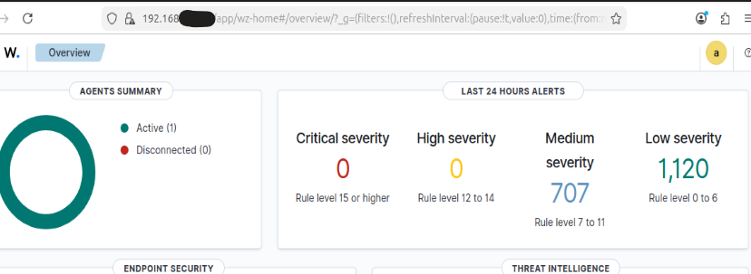

# 🚨 Wazuh SIEM Deployment & File Integrity Monitoring (FIM)

## 🔍 Project Overview
In this project, I deployed a Wazuh SIEM environment to monitor a Windows endpoint and detect unauthorized file activity using File Integrity Monitoring (FIM). The investigation focused on establishing secure communication between the manager and agent, resolving version compatibility issues, and validating real-time alert generation.

---

## 💡 Initial Objective
The objective of this project was to simulate a real-world SOC monitoring environment capable of detecting file-based attacks. Specifically, I aimed to identify file creation, modification, and deletion events on a Windows system and forward them to a centralized SIEM for analysis.

---

## 🛠️ Investigation Steps

### Step 1: Establishing the Manager-Agent Connection
I deployed a Wazuh Manager on an Ubuntu virtual machine and installed a Wazuh Agent on a Windows workstation.

During the initial connection attempt, I identified a version mismatch:
- Manager: v4.12.0  
- Agent: v4.14.4  

This mismatch prevented communication between the systems.

To resolve this, I performed a clean uninstall of the agent and reinstalled version 4.12.0 to match the manager.

I then used the `manage_agents` tool to generate an authentication key and securely register the agent.

---

### Step 2: Verifying Real-Time Agent Activity
After configuring the Manager IP (192.168.254.74) on the Windows host, I verified connectivity using:

agent_control -l

This confirmed that agent ID 010 (DESKTOP-8TFDJBA) was active.

During setup, multiple "ghost" agents were created due to naming conflicts. I identified and isolated the correct active agent to maintain a clean monitoring environment.

---

### Step 3: Configuring File Integrity Monitoring (FIM)
To enable real-time monitoring, I modified the agent’s `ossec.conf` file.

I configured a custom `<syscheck>` rule targeting:

C:\Wazuh-Test

with:

realtime="yes"

This enabled detection of:
- File creation
- File modification
- File deletion

To test the configuration, I created a file named `alert-test.txt` in the monitored directory.

---

### Step 4: Validating SIEM Alert Detection
After generating file activity, I verified that alerts were successfully ingested into the Wazuh dashboard.

The SIEM displayed:
- File Added events  
- File Deleted events  

This confirmed that the detection pipeline was functioning correctly.

---

## 🏁 Project Wrap-Up / Conclusion
This project resulted in a fully functional SIEM pipeline capable of detecting real-time file activity on a Windows endpoint.

By resolving version mismatches, configuring endpoint monitoring, and validating alert ingestion, I demonstrated how Wazuh provides visibility into potential unauthorized system changes.

This setup mirrors real-world SOC workflows used to detect persistence techniques and unauthorized modifications.

---

## 🔒 Mitigation & Recommendations

- Enforce strict version control between SIEM managers and agents to prevent communication failures
- Enable real-time File Integrity Monitoring on sensitive directories (e.g., System32, Program Files)
- Regularly audit and remove inactive or “ghost” agents
- Implement centralized alerting for unauthorized file activity
- Integrate vulnerability detection to identify unpatched systems

---

## 🛡️ Skills Demonstrated
- SIEM Deployment (Wazuh)
- File Integrity Monitoring (FIM)
- Windows Endpoint Configuration
- Linux System Administration
- Troubleshooting Version Mismatches
- Log Analysis & Alert Validation
