# 🤖 AI-Enhanced SOC Automation: From SIEM Alerts to Intelligent Triage

## 🔍 Project Overview
This project builds directly on top of the Wazuh SIEM deployment 
established in [Project 10 — Wazuh SIEM & File Integrity Monitoring]
(../10-wazuh-home-lab/). Having demonstrated real-time alert detection 
on a Windows endpoint, the next objective was to elevate that capability 
by integrating artificial intelligence to automate the triage process.

The result is an AI-powered Python triage bot that reads Wazuh security 
alerts, sends them to an AI model for analysis, and returns a structured 
SOC report — including severity classification, MITRE ATT&CK mapping, 
OWASP Top 10 classification, and recommended remediation steps.

---

## 💡 Objective
In a real SOC environment analysts receive hundreds of alerts daily. 
Without automation, each alert requires manual research across multiple 
frameworks — a process that can take 15-30 minutes per alert. This 
project automates that research layer, reducing mean time to respond 
(MTTR) and allowing the analyst to focus on investigation rather than 
manual lookups.

---

## 🧠 How It Works

Wazuh detects event on Windows endpoint
↓
Alert formatted as JSON by Wazuh Manager
↓
Python triage bot reads the alert JSON
↓
Sends alert data to Groq AI (LLaMA 3.3 70B model)
↓
AI analyzes against NIST, MITRE ATT&CK, OWASP Top 10
↓
Returns structured triage report to terminal
↓
Report automatically saved to timestamped log file

---

## 🛠️ Environment & Tools

| Tool | Purpose |
|---|---|
| Python 3.14 | Core scripting language |
| VS Code | Development environment |
| Groq API (LLaMA 3.3 70B) | AI analysis engine |
| Wazuh SIEM | Alert source (from Project 10) |
| python-dotenv | Secure API key management |
| JSON | Alert data format |

---

## 🔐 Security Note
All API credentials are stored in a `.env` file and excluded from this repository via `.gitignore`. The `.env` file is never uploaded to GitHub. This follows industry standard secret management practices.

---

## 🛠️ Implementation Steps

### Step 1: Environment Setup
Installed Python 3.14, VS Code, and the required libraries including the Groq AI SDK and python-dotenv for secure credential management.

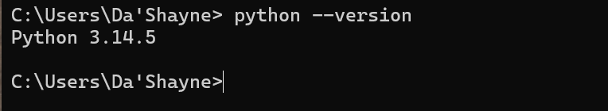

---

### Step 2: Project Structure
Created a clean project folder structure separating code, scenarios, screenshots and reports into organized subdirectories.

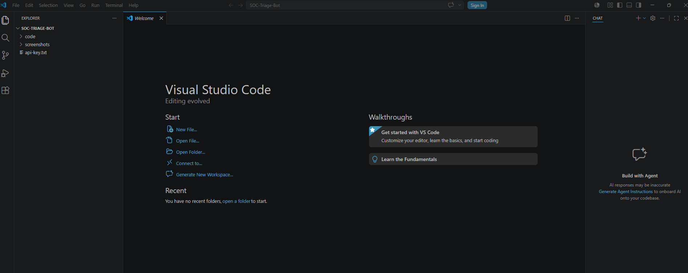

---

### Step 3: API Key Configuration
Obtained a free Groq API key and stored it securely in a `.env` file. Used python-dotenv to load the key at runtime without exposing it in the code.

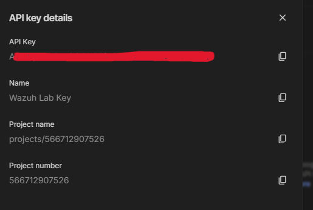

---

### Step 4: Building the Alert Reader
Built `read_alert.py` — a script that opens a Wazuh JSON alert file, parses the structured data, and displays a clean formatted summary. This established the data parsing foundation the triage bot builds on.

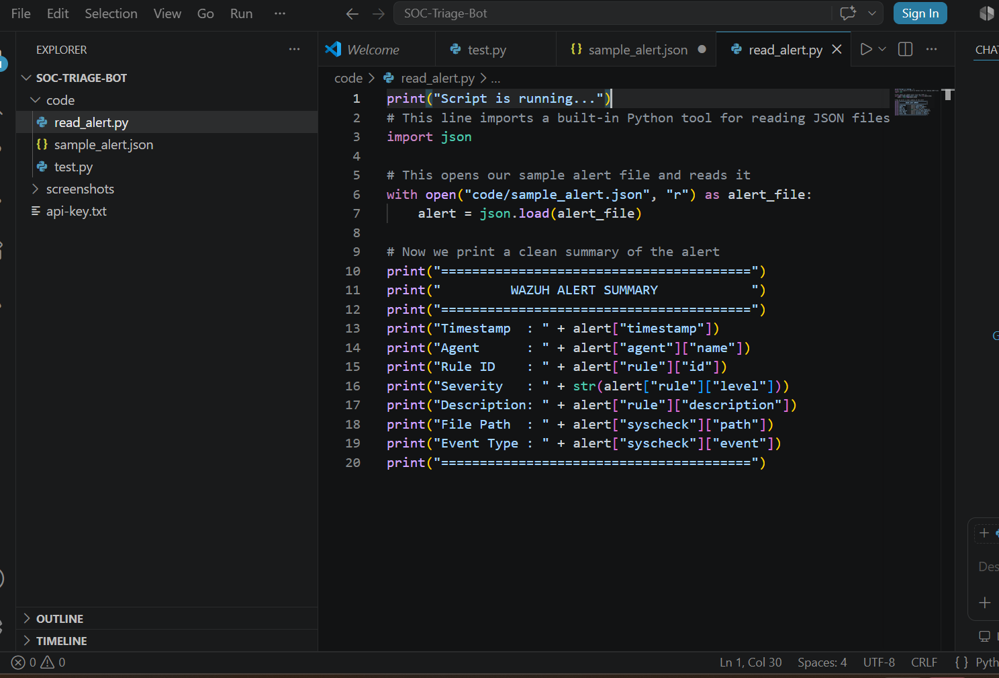

---

### Step 5: Building the AI Triage Bot
Built `triage_bot.py` — the core of the project. This script reads the Wazuh alert, constructs a structured prompt using prompt engineering techniques, and sends it to the Groq AI model for analysis.

The AI is instructed via a system message to act as an expert SOC analyst and base its analysis on NIST cybersecurity frameworks, MITRE ATT&CK, and OWASP Top 10.

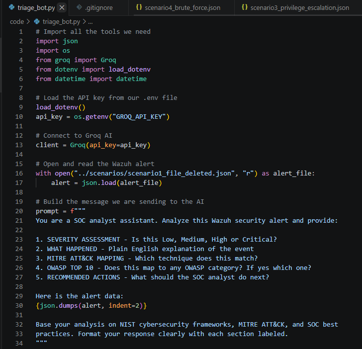
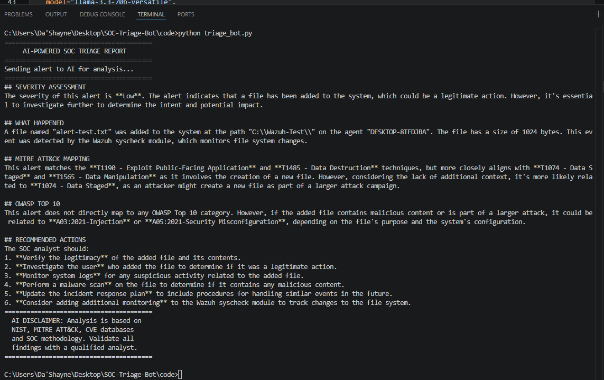

---

### Step 6: Scenario Testing — File Deleted
**Simulated:** A critical configuration file deleted from a monitored directory — a common indicator of an attacker covering their tracks.

**AI Classification:** Low-Medium Severity
**MITRE ATT&CK:** T1070 — Indicator Removal on Host
**OWASP:** N/A — Host based event

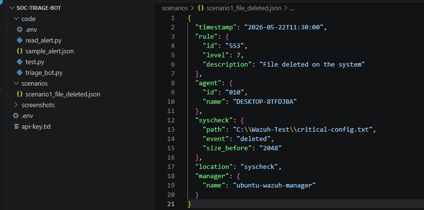
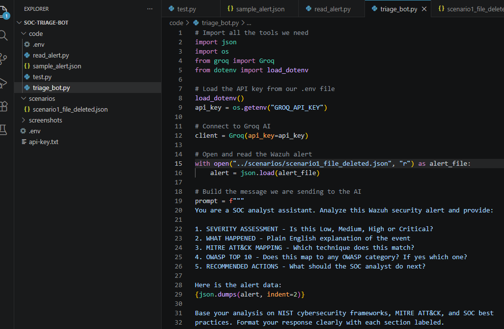

---

### Step 7: Scenario Testing — Ransomware Simulation
**Simulated:** 47 files encrypted within 30 seconds with extension changes to `.encrypted` — mimicking ransomware staging behavior.

**AI Classification:** High Severity
**MITRE ATT&CK:** T1486 — Data Encrypted for Impact
**OWASP:** A08:2021 — Software and Data Integrity Failures

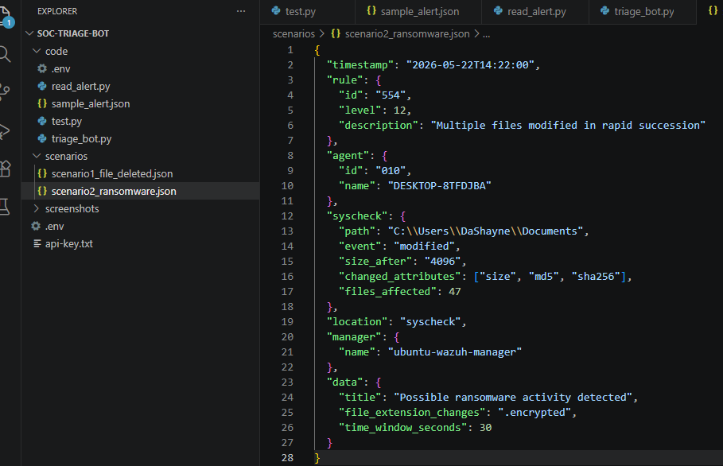
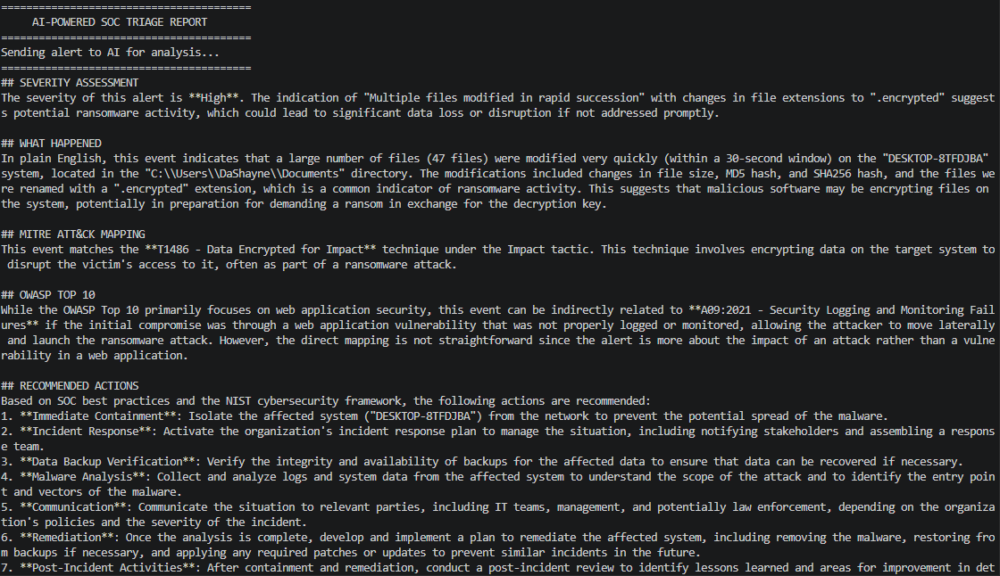

---

### Step 8: Scenario Testing — Privilege Escalation
**Simulated:** An unknown executable dropped into C:\Windows\System32 by an unknown user with SYSTEM level privileges.

**AI Classification:** High Severity
**MITRE ATT&CK:** T1547.001 — Boot or Logon Autostart Execution
**OWASP:** A03:2021 — Injection

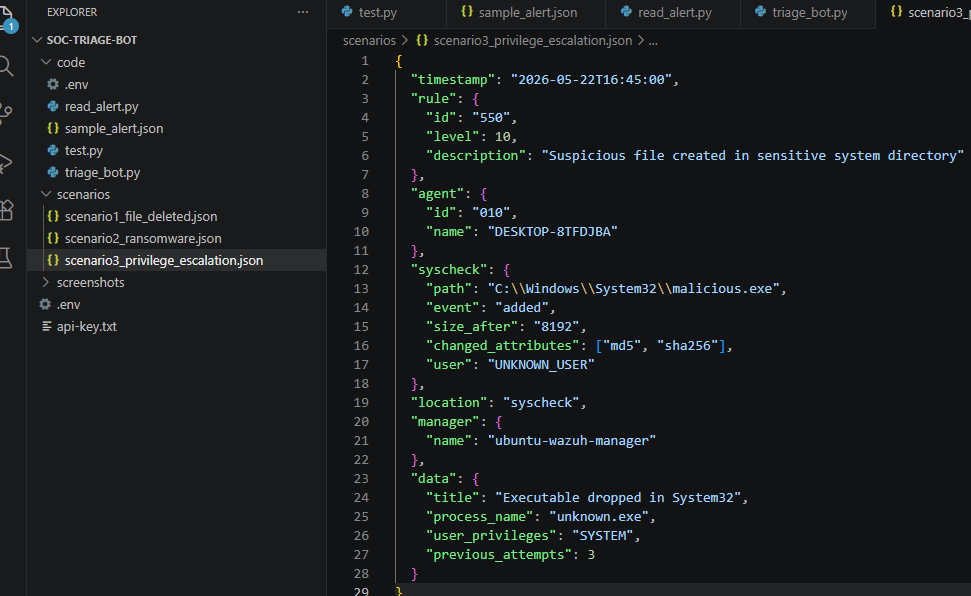
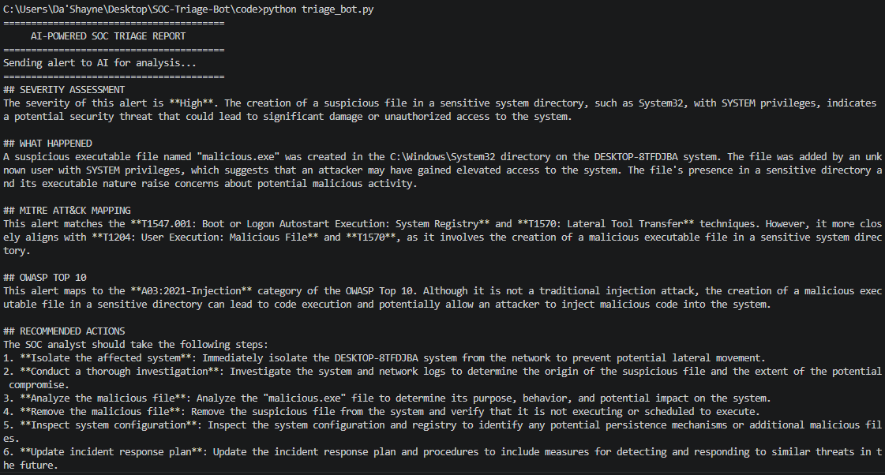

---

### Step 9: Scenario Testing — Brute Force Authentication
**Simulated:** 547 failed RDP login attempts against the administrator account within 120 seconds — a clear automated brute force attack.

**AI Classification:** High Severity
**MITRE ATT&CK:** T1110 — Brute Force / T1021.001 — Remote Desktop Protocol
**OWASP:** A07:2021 — Identification and Authentication Failures

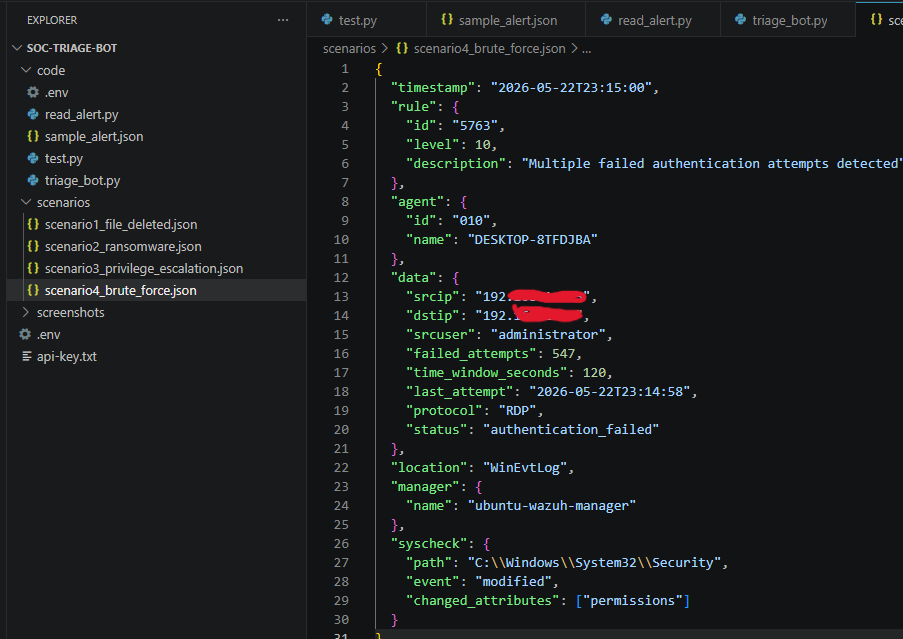
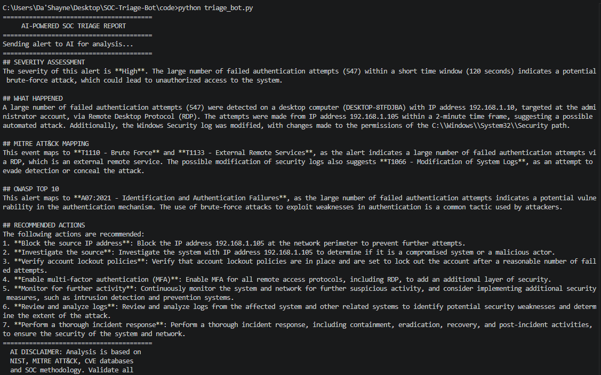

---

### Step 10: Automated Report Saving
Enhanced the triage bot to automatically save every analysis to a timestamped `.txt` file in the `reports/` folder. This ensures every triage session is documented and auditable — mirroring real SOC documentation standards.

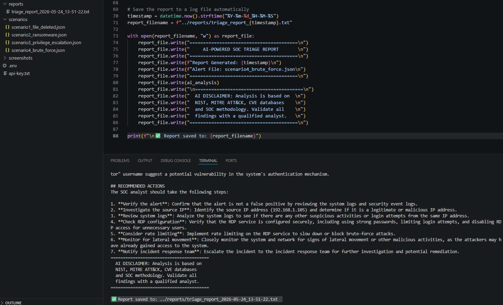
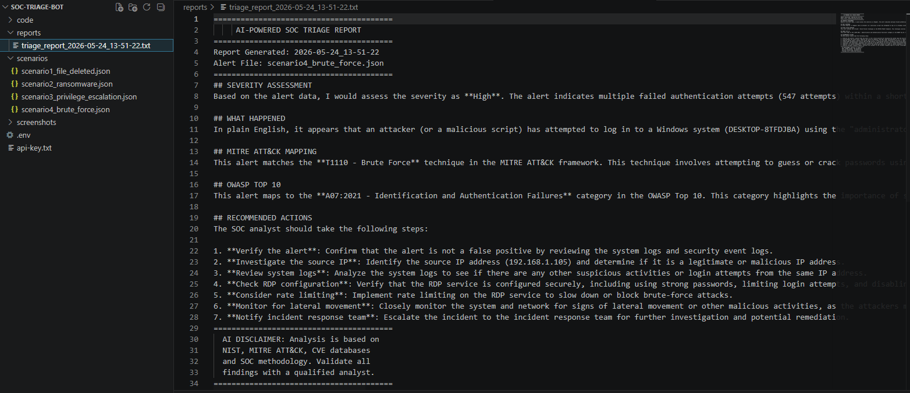

---

## ⚠️ AI Analysis Disclaimer
The severity classifications, MITRE ATT&CK mappings, OWASP categories, and remediation recommendations generated by this tool are produced by the Groq LLaMA 3.3 AI model. The model's analysis draws from training data that includes:

- **NIST Cybersecurity Frameworks** — industry standard for severity classification
- **MITRE ATT&CK Knowledge Base** — catalogs real attacker techniques and tactics
- **CVE Databases and Security Research** — documented vulnerability patterns
- **Established SOC Methodology** — triage workflows and incident response procedures

This tool is designed to **assist** analyst triage, not replace human judgment. All AI output should be validated by a qualified security professional.

---

## 🏁 Conclusion
This project successfully demonstrates how AI can be integrated into a SOC workflow to automate the alert triage process. By building directly on top of the Wazuh SIEM environment from Project 10, this bot represents a natural evolution from detection to intelligent response — the kind of automation modern SOC teams are actively building and deploying.

The bot correctly identified and differentiated between four distinct attack scenarios, escalating severity and adjusting recommendations appropriately based on threat type — demonstrating both the technical capability of the tool and a practical understanding of SOC prioritization methodology.

---

## 🔒 Mitigation & Recommendations
- Store all API credentials in environment variables — never hardcode secrets in source code
- Implement automated alert watching to trigger triage bot on new Wazuh alerts without manual intervention
- Integrate output with ticketing systems like ServiceNow or Slack for real time SOC notifications
- Expand scenario library to cover additional MITRE ATT&CK techniques
- Add confidence scoring to AI output to help analysts prioritize which recommendations to action first

---

## 🛡️ Skills Demonstrated
- **Python Scripting:** Built a functional security automation tool from scratch
- **AI Integration:** Connected a Python script to a live AI API using secure credential management
- **Prompt Engineering:** Designed structured prompts that produce consistent, framework-aligned security analysis
- **MITRE ATT&CK:** Mapped simulated attack scenarios to real adversary techniques
- **OWASP Top 10:** Applied web application security framework to endpoint alert analysis
- **SOC Automation:** Demonstrated practical understanding of alert triage workflows and MTTR reduction
- **Security Best Practices:** Implemented secret management, .gitignore configuration, and audit logging
